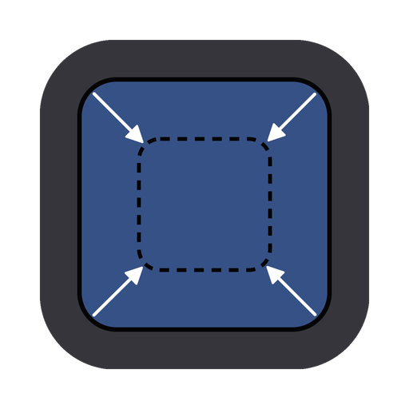

<p align="center">
    
    <h1 align="center">App icon resizer</h1>
</p>

## About this project

Convert your icon to different size for MacOS app icon

## Framework Used

- Tauri
- React
- [icon-image](https://github.com/ElvisWong213/icon-image)

## Requirements

- Rust 1.76.0+
- Tauri 1.6.0+

## Download

[](https://apps.apple.com/us/app/app-icon-resizer/id6479561103)

## Setup

Run the command to start the app.
```
cargo tauri dev
```
## Screenshot

https://github.com/ElvisWong213/icon-resizer-ui/assets/40566101/7668eaf3-6731-48bf-9281-c347b84db768


